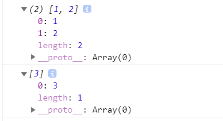

# js精粹

## 1. 知识点一

* var语句被用在函数内部时，他定义的是这个函数的私有变量
* 变量应该定义在函数的头部，而不是花括号
* 值的真假

> `false,null,undefined,空字符串'',数字0，数字NaN`
>
> 所有对象都是真

* `for in`语句（遍历一个对象的所有属性，包括prototype中的属性）

```js
for (myvar in obj) {
    // 这个方法不会检查原型链
    if (obj.hasOwnProperty(myvar)){
        // do something...
    }
}
```

* label的使用

```js
var num = 0;
outermost:
for (var i=0; i < 10; i++) {
     for (var j=0; j < 10; j++) {
        if (i == 5 && j == 5) {
            break outermost;
        }
        num++; 
    }
}
alert(num);    //55


var num = 0;
outermost:
for (var i=0; i < 10; i++) {
    for (var j=0; j < 10; j++) { 
        if (i == 5 && j == 5) { 
            continue outermost;
    }
        num++; 
   }
}
alert(num);    //95
```

* `typeof`产生的值有number，string，boolean，undefined，function，object

> 注意：
>
> `typeof null`返回的是object，但是null又是属于基本数据类型
>
> ``` js
> function deepClone(obj) {
>   if (obj === null) return null; //null 的情况
>   if (obj instanceof RegExp) return new RegExp(obj); //正则表达式的情况
>   if (obj instanceof Date) return new Date(obj); //日期对象的情况
>   if (typeof obj === 'function') {
>     // Function来新构建函数对象，和之前的eval相比，
>     // 1：精简代码
>     // 2. 作用域被控制了
>     // 3. 安全性提高
>     // 4. 运行速度提高
>     return new Function('return(' + obj.toString() + ')')();
>   }
>   if (typeof obj != "object") {
>     //非复杂类型,直接返回 也是结束递归的条件
>     return obj;
>   }
>   //[].__proto__.constructor=Array()
>   //{}.__proto__.constructor=Object()
>   //根据obj的原型对象中的constructor创建新的obj对象，obj可以为{},[],或则自己定义的对象
>   var newObj = new obj.__proto__.constructor;
>   for (var key in obj) {
>     newObj[key] = deepClone(obj[key]);
>   }
>   return newObj;
> }
> ```
>
> 
>
> `typeof [1,2,3]`返回的也是object

* 对于对象字面量声明的对象，他的`_proto_`属性指向`Object.prototype`
* 对于利用构造函数的实例化声明的对象，他的`_proto_`指向的是`构造函数名.prototype`，然后这个prototype中有constructor属性指向构造函数本身，还有一个`_proto_`属性指向`Object.prototype`

```js
// 对象字面量
var scoopse1 = {
    first_name: 'chinbor',
    last_name: 'Mn'
}
// 构造函数
function scoopse2 () {
    this.first_name = 'chinbor';
    this.lase_name = "Mn";
}
// 原型链继承
if (typeof Object.beget !== 'function') {
    Object.create = function (o) {
        var F = function () {};
        F.prototype = o;
        return new F();
    }
}
// 利用构造函数方法实例化对象，然后继承
var parent_class = new scoopse2();
var child_class1 = Object.create(parent_class);
// 利用字面量方法然后继承 
var child_class2 = Object.create(scoopse1);

// 实例化方法
console.log(parent_class);
// 对象字面量
console.log(scoopse1);
// 继承的实例化方法
console.log(child_class1);
// 继承的对象字面量
console.log(child_class2);


// 更改继承过来的属性看原型中的属性是否更改（这里实际上是在自己对象创建了属性，而不是修改的继承过来的属性，因为继承过来的属性只是检索值的时候会到原型链寻找）
child_class1.first_name = 'Bob';
child_class2.first_name = 'Bob';

console.log(scoopse1.first_name);
console.log(parent_class.first_name);

```

运行结果：


## 2. 知识点二

### 2.1减少全局变量污染

* 为你的程序建立一个唯一的全局变量（其余的变量，函数，都成为他的属性）

* 这样的好处是能够减少命名冲突，因为你程序中就一个全局变量名字

```js
var MYSPACE = {};
MYSPACE.st = {
    firsr_name: 'chinbor',
    last_name: 'Mn'
};
MYSPACE.bt = {
    fuck: {
        me: 'xixi',
        you: 'heihei'
    },
    papa: function () {
        // do something...
    }
}
```

### 2.2 枚举

* 利用`for in`以及`hasOwnProperty()`检查是否是自己的属性

### 2.3 匿名函数（anonymous）也叫函数字面量写法

```js
var func = function (a,b) {
	// do something...
}
```

### 2.4 函数除了声明时定义的形式参数，每个函数还接受两个附加参数：this和arguments

* 关于函数调用时的this

>1. 方法调用模式  
>
>```js
>obj.create()
>```
>
>1. 函数调用模式
>
>```js
>func()
>```
>
>1. 构造器调用模式
>
>```js
>var a = new Func()
>```
>
>1. call，apply，bind调用（显示指明函数执行时候的this值）
>
>```js
>func.call(上下文,参数1，参数2,...)
>```

* 关于arguments（一个数组，里面元素都是参数）

### 2.5 函数总是会返回一个值，若没有指明返回值，则返回undefined，但是若你加了new关键字（也就是构造器调用模式），若你的返回值不是对象，那么返回的将是这个this（也就是你利用构造器实例化的对象），否则就是你return的那个对象

```js
// 构造函数
function Scoopse2 () {
    this.first_name = 'chinbor';
    this.lase_name = "Mn";
    return {
        name: 'hinbor'
    };
}

var classc = new Scoopse2();
console.log(classc); // {name:'hinbor'}

```

### 2.6 关于Function对象的一些说明

#### 2.6.1 JavaScript 的 **`Number`** 对象是经过封装的能让你处理数字值的对象。`Number` 对象由 `Number()` 构造器创建。

```js
var a = new Number(value);// a为一个Number类型的对象
```

#### 2.6.2 一张关于原型链的究极图以及能够很好说明的一个例子（包括Function，Object）


代码说明：这段代码很好的说明了如何给基本类型添加方法

```js
// 1. 在Function函数的原型对象中定义方法method
Function.prototype.method = function (name,func) {      
    // 这里这个this代表的就是Number实例化对象(Function的实例化对象)，但是请注意这个实例化对象
    // 是个函数,其中存在prototype属性
    // 增加一个判断，因为你命名的方法可能与他自己的方法名字相同，比如trim就是
    if (!this.prototype[name]) {
    	this.prototype[name] = func;
    }
    return this;
}

// 2. Number是构造函数Number()的函数名，由于所有函数都是Function函数的实例化对象，
// 所以Number作为Function()的实例化对象存在_proto_属性指向Function.prototype，
// 作为构造函数又存在prototype属性其中包含constructor属性（指向Number函数）和_proto_属性(指向
// Object.prototype),这里就能明白这个method方法就是通过Number的_proto_属性指向Function.prototype
// 而查找到的
Number.method('integer',function () {
    console.log(this);
    return Math[this < 0 ? 'ceil' : 'floor'](this);
});
String.method('trim',function () {
    console.log(this);
    // \s代表空白字符+代表匹配前者1次或多次，g是flag代表全局匹配，^代表开头，$代表结尾
    return this.replace(/^\s+|\s+$/g,'');
});
// 3. 这里的(-10 / 3)是Number类型，也就是Number构造函数的实例化对象，所以会寻找_proto_属性(指向
// Number.prototype)看是不是有integer方法
console.log((-10 / 3).integer());
console.log('"' + '  neat  '.trim() + '"');
```

### 2.7 内部函数能访问外部函数的实际变量而无须复制（也就是同一个地址的变量）

```js
// 会点击按钮弹出6，所有都是6
var add_the_handler = function (nodes) {
    for (var i = 0; i < nodes.length; i++) {
        nodes[i].onclick = function (e) {
            alert(i+1);
        }
    }
};
// 解决方法一：闭包
var add_the_handler = function (nodes) {
    var i;
    for (i = 0; i < nodes.length; i++) {
        (function (i) {
            nodes[i].onclick = function (e) {
                alert(i+1);
            }
        })(i);
    }
};
// 解决方法二：let声明变量（块级作用域）
var add_the_handler = function (nodes) {
    for (let i = 0; i < nodes.length; i++) {
        nodes[i].onclick = function (e) {
            alert(i+1);
        }
    }
};

var btns = document.getElementsByClassName('btn');
add_the_handler(btns);
```

### 2.8 模块模式：一个定义了私有变量和函数的函数，利用闭包创建可以访问私有变量和函数的特权函数，最后返回这个特权函数，或则把它们保存到一个可访问到的地方，优点：对于应用程序的封装，或则构造其他单例对象很爽

代码1：

```js
// 1. 在Function函数的原型对象中定义方法method
Function.prototype.method = function (name,func) {      
    // 这里这个this代表的就是Number实例化对象(Function的实例化对象)，但是请注意这个实例化对象
    // 是个函数,其中存在prototype属性
    // 增加一个判断，因为你命名的方法可能与他自己的方法名字相同，比如trim就是
    if (!this.prototype[name]) {
        this.prototype[name] = func;
    }
    return this;
}

String.method('deentityify',function () {
    var entity = {
        quot: '"',
        lt: '<',
        gt: '>'
    };
    // 下面这个就是特权函数（利用闭包立即调用）
    return function () {
        return this.replace(/&([^&;]+);/g,function (a,b) {
            console.log(a);
            console.log(b);          
            var r = entity[b];
            return typeof r === 'string' ? r : a;
        })
    }
}());
console.log('&lt;&quot;&gt;'.deentityify());
```

代码2：（注意这里每次调用serial_maker函数生成的对象都是不同的堆空间中的对象，所以地址不同）

```js
var serial_maker = function () {
    var prefix = '';
    var seq = 0;
    return {
        name: 'chinbor',
        age: 18,
        set_prefix: function (p) {
            prefix = String(p);
        },
        set_seq: function (s) {
            seq = s;
        },
        gensym: function () {
            var result = prefix + seq;
            seq += 1;
            return result;
        } 
    };
};
var seqer = serial_maker();
var seqer1 = serial_maker();
console.log(seqer === seqer1);
seqer.name = 'Bopb';
console.log(seqer.name);

console.log(seqer1.name);

seqer.set_prefix('Q');
seqer.set_seq(1000);
var unique = seqer.gensym();
console.log(unique);
```

### 2.9 关于arguments

* arguments并不是数组，而是类数组对象，（其中含有length属性）所以不会存在数组的方法
* 可以利用`var args = Array.prototype.slice.call(arguments)`将他转化成数组
* 柯里化：允许我们把函数与传递给他的参数结合，产生一个新的函数，为什么这样做，因为柯里化也称为局部套用，就是把多参数函数转换成一系列单参数函数并进行调用的技术

```js
Array.prototype.slice = function(start,end){
    var result = new Array();
    start = start || 0;
    end = end || this.length; //this指向调用的对象，当用了call后，能够改变this的指向，也就是指向传进来的对象，这是关键，而且关键是其中含有length属性
    for(var i = start; i < end; i++){
        result.push(this[i]);
    }
    return result;
}
```

再看一个关于柯里化的例子了解（add原本是需要两个参数，但这里一些手段，先调用但参数curry函数，然后返回结果赋值add2然后再单参数调用）：

```js
// 1. Function函数也是Funcion实例的构造函数
Function.prototype.method = function (name,func) {
    console.log(this);
    if (!this.prototype[name]) {
        this.prototype[name] = func;
    }
    return this;
}
// 2. Function实例，查找他的_proto_属性(指向Function.prototype)然后找到方法method
Function.method('curry',function () {
    console.log(this);

    // 2.1 将类数组对象(其中含有length属性)转化成数组对象
    var slice = Array.prototype.slice,
        args = slice.call(arguments),
        that = this;
    // 2.2 返回的这个函数是一个特权函数，能够访问私有属性，也叫做闭包
    return function () {
        return that.apply(null,args.concat(slice.call(arguments)))
    }

})
// 3. 定义的一个add函数
var add = function (a,b) {
    console.log(a);
    console.log(b);

    return a + b;
};
// 4. add是一个函数，是Function的实例化对象，其中有_proto_属性（指向Function.prototype）
// 和prototype属性，add.curry的意思就是他当成一个实例化对象调用curry方法，于是顺着_proto_向上找
// 找到了curry方法
var add2 = add.curry(1);
console.log(add2(6));
```

### 2.10  记忆功能

```js
// 1. 普通版的fibonacci数列
var fibonacci = function (n) {
    // console.log(1);
    return n < 2 ? n : fibonacci(n-1) + fibonacci(n-2);
}
// 2. 优化版的fibonacci数列,以空间换时间
var fibonacciAdvanced = function () {
    var memo = [0,1];
    var fib = function (n) {
        console.log(1);

        var res = memo[n];
        if (typeof res !== 'number') {
            res = fib(n - 1) + fib(n - 2);
            memo[n] = res;
        }
        return res;
    }
    return fib;
}();
// 3. 抽离，编写出一个帮助构造带有记忆功能的函数
function memoryFunc (memo,formula) {
    var fib = function (n) {
        console.log(1);
        var res = memo[n];
        if (typeof res !== 'number') {
            res = formula(fib,n);
            memo[n] = res;
        }
        return res;
    }
    return fib;
}
// 带有记忆功能的计算fibonacci数列的函数
var fibonacciTop = memoryFunc([0,1],function (func,n) {
    return func(n-1) + func(n-2);
});
// 带有记忆功能的阶乘函数
var factorial = memoryFunc([1,1],function (func,n) {
   return n * func(n-1); 
});

for (var i = 0;i <= 10;i++) {
    // 1. 普通写法
    // console.log('//' + i + fibonacci(i));
    // 2. 带有记忆功能的写法
    // console.log('//' + i + fibonacciAdvanced(i));
    // 3. 也是带有记忆功能，只不过这个是通过抽离出来的模板函数构建的
    console.log('//' + i + fibonacciTop(i));
}
console.log('==================================================')
for (var i = 0;i <= 10;i++) {
    console.log('//' + i + factorial(i));
}
```

## 3. 知识点三（继承）

### 3.1 模仿new运算符（若返回值不为对象，那么就返回this，否则若返回值为对象，那么返回这个对象）

```js
Function.prototype.method = function (name,func) {
    console.log(this);
    if (!this.prototype[name]) {
        this.prototype[name] = func;
    }
    return this;
}

Function.method('new',function () {
    console.log(this.prototype);

    var that = Object.create(this.prototype);
    console.log(that);
    var other = this.apply(that,arguments);
    // 这里运用了&&（前真那么结果等于后面）和||（前假那么结果等于后面）
    return (typeof other === 'object' && other) || that;                                                   
});

var Mammal = function (name) {
    this.name = name;
}

var myMammal = Mammal.new('hello');
console.log(myMammal);
```

### 3.2 关于`Object.create()`

作用就是构造一个已经存在的对象的新实例，这个实例的`_proto_`属性指向这个对象

```js
// 对象字面量表示法，_proto_指向Object.prototype
var myMammal = {
    name: 'chinbor',
    get_name: function () {
        return this.name;
    },
    says: function () {
        return this.saying || '';
    }
};
// 函数也是对象,是Function构造函数的一个实例化对象，其中作为
// 函数存在prototype属性（有constructor属性和_proto_属性(指向Object.prototype)）
// 和作为实例化对象存在_proto_属性，_proto_指向
// Function.prototype(其中存在constructor和_proto_属性（指向Object.prototype）)
var Mammal = function (name) {
    this.name = name;
}
// 通过Object,create()创建一个对象myCat，这个对象的_proto_ = myMammal
var myCat = Object.create(myMammal);
// 通过Object,create()创建一个对象myASD，这个对象的_proto_ = Mammal
var myASD = Object.create(Mammal);
console.log(myCat);
console.log(myASD);
```

### 3.3 函数化模式的继承方法（可以保护隐私，也就是内部的私有变量或私有方法不会暴露出去，还有就是访问父类方法的能力）我们下面的例子中`coocat`中就存在访问父类也就是cat中的`get_name`方法

伪类模式就是指的构造器函数模式，他利用构造器函数的原型（prototype）等于对象（父类的实例化对象）来继承

```js
// 为所有的函数添加method方法
// 因为所有函数都是Function函数的实例化对象
Function.prototype.method = function (name,func) {
    console.log(this);
    if (!this.prototype[name]) {
        this.prototype[name] = func;
    }
    return this;
}
Object.method('superior',function (name) {
    var that = this,
        method = that[name];
    return function () {
        return method.apply(that,arguments);
    };
})
// 函数化模式的继承方法
// 这样的好处：
// 1. 函数内部新建一个对象
// 2. 对于函数内部定义的私有变量或方法不会暴露出去
var mammal = function (spec) {
    var that = {};
    that.get_name = function () {
        return spec.name;
    };
    that.says = function () {
        return spec.saying || '';
    };
    return that;
};
var cat = function (spec) {
    spec.saying = spec.saying || 'meow';
    var that = mammal(spec);
    that.purr = function (n) {
        var i, s = '';
        for (i = 0; i < n; i++) {
            if (s) {
                s += '-';
            }
            s += 'r';
        }
        return s;
    }
    that.get_name = function () {
        return that.says() + ' ' + spec.name + ' ' + that.says();
    }
    return that;
};
var coocat = function (spec) {
    var that = cat(spec),
        // 注意这里
        super_get_name = that.superior('get_name');
    that.get_name = function (n) {
        return 'like ' + super_get_name() + ' baby';
    };
    return that;
};
var myCoolCat = coocat({name: 'Bix'});
var name = myCoolCat.get_name();
console.log(name);
```

### 3.4 部件（直接上代码吧，相当于解释了js中的事件）

```js
var eventuality = function (that) {
    // 私有的事件注册表对象
    var registry = {};

    // 触发事件，根据传入的事件类型进行判断，然后执行事件处理函数
    // 该事件可以是一个包含事件名称的字符串，或则是一个拥有包含事件名称的type属性的对象
    // 通过'on'方法注册的事件处理程序中匹配事件名称的函数将被调用
    that.fire = function (event) {
        var array,
            func,
            handler,
            i,
            type = typeof event === 'string' ? event : event.type;
        if (registry.hasOwnProperty(type)) {
            array = registry[type];
            // 若对应的事件存在一组事件处理程序，比如说你绑定了多个点击事件，那么循环调用事件处理程序
            for (i = 0; i < array; i++) {
                handler = array[i];
                func = handler.method;
                if (typeof func === 'string') {
                    func = this[func];
                }
                func.apply(this,handler.parameters || [event]);
            }
        }
        return this;
    };

    // 注册事件，包括事件类型，处理函数，传入处理函数的参数
    that.on = function (type, method, parameters) {
        var handler = {
            method: method,
            parameters: parameters
        };
        if (registry.hasOwnProperty(type)) {
            registry[type].push(handler);
        } else {
            registry[type] = [handler];
        }
        return this;
    };
    return that;
};
```

## 4. 知识点四（数组）

### 4.1 数组字面量对象继承自Array.prototype，同时数组含有一个length属性

### 4.2 for in枚举对象无法保证属性的顺序，可以利用for循环语句遍历数组属性

```js
var i;
for (i = 0; i < myArray.length; i++) {
    console.log(myArray[i]);
}
```

### 4.3 为数组添加一个reduce方法

```js
Function.prototype.method = function (name, func) {
    if (!this.prototype[name]) {
        this.prototype[name] = func;
    }
    return this;
};
Array.method('myreduce', function (f, value) {
    var i;
    for (i = 0; i < this.length; i++) {
        value = f(this[i], value);
    }
    return value;
});
var data = [4, 8, 15, 16, 23, 42];
var dataSun;
var add = function (a, b) {
    return a + b;
};
var mult = function (a, b) {
    return a * b;
};
var sum = data.myreduce(add, 0);
var product = data.myreduce(mult, 1);
// 因为数组也是对象，所以可以给数组添加‘total’字符串属性，但是这样不会改变他的length属性
data.total = function () {
    return this.myreduce(add, 0);
};
total = data.total();
// Object.create()方法用在数组上是没有用的,因为它产生一个对象，而不是数组（没有length属性）。产生的对象将继承这个数组的值和方法
dataSun = Object.create(data);
console.log(dataSun);
// 虽然添加了total属性，但是length还是6
console.log(data);
console.log(sum);
console.log(product);
console.log(total);
```

### 4.4 为数组指定初始值

```js
// 初始化数组的一个函数
Array.dim = function (dimension, initial) {
    var a = [], i;
    for (i = 0; i < dimension; i++) {
        a[i] = initial;
    }
    return a;
};
var i, j, n = 3, my_array = [];
var myArray = Array.dim(10, 0);
console.log(myArray);
// 二维数组
var matrix = [
    [1, 2, 3],
    [4, 5, 6],
    [7, 8, 9]
];
// 遍历二维数组的元素
for (i = 0; i < matrix.length; i++) {
    for (j = 0; j < matrix[i].length; j++) {
        console.log(matrix[i][j]);
    }
}
// 注意你不能使用dim函数来创建二维数组
// 因为你传入的形参[]是对象，那么initial就是它的引用，
// 那么你的每一个一维元素所赋值的都是同一个堆空间的引用
// var myMatrix = Array.dim(10, []);
// 所以要想自己创建一个二维数组可以这样做,但是每一个元素的初始值都为undefined
for (i = 0; i < n; i++) {
    my_array[i] = [];
}
// 构造矩阵并初始化元素值为initial的方法
Array.matrix = function (m, n, initial) {
    var a, i, j, mat = [];
    for (i = 0; i < m; i++){
        // 每一次都让a指向一个新的空间
        a = [];
        for (j = 0; j < n; j++) {
            a[j] = initial;
        }
        mat[i] = a;
    }
    return mat;
};
var myMatrix = Array.matrix(3, 3, 0);
console.log(myMatrix[2][2]);
// 构造单位矩阵的方法
Array.identity = function (n) {
    var i, mat = Array.matrix(n,n,0);
    for (i = 0; i < n; i++) {
        mat[i][i] = 1;
    }
    return mat;
};
myMatrix = Array.identity(4);
console.log(myMatrix[3][3]);
```

## 5. 知识点五（正则表达式）

```js
// 说明一下
// (?:.....)代表非捕获型分组，也就是说不会复制它所匹配的文本放在result数组中
// (...)表示捕获型分组，会将匹配文本复制到result数组中，第一个捕获分组对应下标1
// ?表示匹配0或1次
// +表示匹配1或多次
// [A-Za-z]表示匹配A到Z，a到z中的一个
// {0,3}表示匹配0次或1到3次
// \/表示匹配/,转义
// [^?#]表示除?#之外的字符
// *表示0次或多次
// .会匹配除行结束符以外的所有字符
var parse_url = /^(?:([A-Za-z]+):)?(\/{0,2})([0-9.\-A-Za-z]+)(?::(\d+))?(?:\/([^?#]*))?(?:\?([^#]*))?(?:#(.*))?$/;
var url = 'https://www.chinbor.xyz:8080/goodboy/fuckeverything?name=bob&age=16#1';
var result = parse_url.exec(url);
console.log(result);

var names = ['url', 'scheme', 'slash', 'host', 'port', 'path', 'query', 'hash'];
var blanks = '        ';
var i;
for (i = 0; i < names.length; i++) {
    console.log(names[i] + ':' + blanks.substring(names[i].length) + result[i]);
}
```

```js
// 说明一下[+\-]这里表示的意思是匹配字符+或-，为什么会转义-，因为在[]中的-表示连字符的意思
var parse_number = /^-?\d+(?:\.\d*)?(?:e[+\-]?\d+)?$/i;
var test = function (num) {
    console.log(parse_number.test(num));
};
test(1); 
test(1.1);
test(1e10);
test(-10);
```

关于书中的错误的说明（书中说x和y指向同一个对象，实际是不同对象）

``` js
function make_a_matcher () {
// 相当于调用了new RegExp()创建对象
return /a/gi;
}
function test () {
// 相当于调用了new Object()创建对象
return {
name: 'hinbor',
age: 18
};
}
var x = make_a_matcher();
var y = make_a_matcher();
x.lastIndex = 10;
console.log(y.lastIndex);

var mzb1 = test();
var mzb2 = test();
mzb1.name = 'bob';
console.log(mzb1 === mzb2);

console.log(mzb1);
console.log(mzb2);
```

关于正则表达式分支匹配，|分隔多个匹配序列，但是只要一个匹配满足就不会继续了

```js
"into".match(/in|int/)
// 只会匹配in不会匹配int
```

当`lastIndex`属性为0，一个未转义的^会匹配文本的开始。当指定了m标识，它也能匹配行结束符，一个未转义的$将匹配文本的结束。当指定了m标识，它也能匹配行结束符

关于\1,表示指向分组1所捕获的文本的一个引用

```js
var doubled_words = /([A-Za-z\u00C0-\u1FFFF\u2800-\uFFFD]+)\s+\1/gi;
```

### 5.1 正则表达式的分组

#### 5.1.1 捕获型

* `(.....)`第一个捕获的分组为1，用`\1`表示

#### 5.1.2 非捕获型

* `(?:.....)`只做简单的匹配，并不会捕获所匹配的文本，不会干扰捕获型分组的编号

#### 5.1.3 向前正向匹配

* `(?=....)`类似于非捕获型分组，但在这个组匹配后，文本会倒回到它开始的地方，实际上并不匹配任何东西

```js
var str = 'fuckyuouword';
var pattern = /[wo]+(?=[rd]+)/;
var results = pattern.exec(str);
console.log(results[0]); // wo
```

#### 5.1.4 向前负向匹配

* `(?!.....)`类似于向前正向匹配，但只有当他匹配失败时它才继续向前匹配

```js
var str = 'fuckyuouword';
var pattern = /[wo]+(?![rd]+)/;
var results = pattern.exec(str);
console.log(results[0]); // o这个o是index=6的那个o
```

### 5.2 贪婪和非贪婪匹配

#### 5.2.1 贪婪匹配

当正则表达式中包含能接受重复的限定符时，通常的行为是（在使整个表达式能得到匹配的前提下）匹配**尽可能多**的字符。以这个表达式为例：`a.*b`，它将会匹配最长的以a开始，以b结束的字符串。如果用它来搜索`aabab`的话，它会匹配整个字符串`aabab`。这被称为**贪婪**匹配。

#### 5.2.2 懒惰匹配（前面的例子`aabab`，如果使用`a.*?b`将匹配`aab`）


`tips:`书中建议最好使用贪婪性匹配

## 6. 知识点六（一套小型的可用在标准类型上的标准方法集）

### 6.1 关于浅拷贝

```js
function shallowCopy (obj) {
    var dst = {};
    for (var prop in obj) {
        if (obj.hasOwnProperty(prop)) {
            // 对于obj[hobbies]其实是一个地址，指向的堆空间中的一个区域，
            // 所以这里的赋值其实是地址的赋值,然而对于基本数据类型（string,number,boolean,NaN等）则是
            // 直接在栈空间开辟新空间来存放
            dst[prop] = obj[prop];
        }
    }
    return dst;
}
var obj1 = {
  	name: 'chinbor',
  	age: 18,
    hobbies: [
        '打球',
        '逛街'
    ]
};
var obj2 = shallowCopy(obj1);
obj2.hobbies[0] = '跳舞';
console.log(obj1.hobbies);
// ['跳舞','逛街']
console.log(obj2.hobbies);
// ['跳舞','逛街']
```

### 6.2 `array.concat()`方法（对于其中的元素为引用类型，那么复制的其实是地址，所以通过c更改age会影响到a，因为是同一个堆空间地址）

```js
var a = [{name: 'chinbor',age: 18}, 'b', 'c'];
var b = ['x', 'y', 'z'];
var c = a.concat(b,1);
c[0].age = 23;
console.log(a);
console.log(c);
```

上述代码执行结果：


###  6.3 `array.pop()`方法

```js
Function.prototype.method = function (name, func) {
    if (!this.prototype[name]) {
        this.prototype[name] = func;
    }
    return this;
};
// 自己实现
Array.method('mypop', function () {
    return this.splice(this.length - 1, 1)[0];
}) 


var a = [1,2,{name: 'chinbor',age: 18}];
var d = a.mypop();
console.log(a);
console.log(d);
var c = a.pop();
console.log(a);
console.log(c);
```

运行结果：


### 6.4 `array.splice()`方法

#### 6.4.1 demo1:

```js
var a = [1,2,3];
var c = a.splice(a.length,1);
console.log(a);
console.log(c);
```

运行结果：



#### 6.4.2 demo2:

```js
var a = ['a','b','c'];
var r = a.splice(1,1,'ache','bug');
var d = a.splice(1,0,'fuck','you');
// a是['a','ache','bug','c']
// r是['b']
// d是['a','fuck','you','b','c']
```

#### 6.4.3 自己实现（关于Math，其实是一个对象，因为其中含有`_proto_`属性并指向`Object.prototype`）,有时间再来腾吧，现在先不折腾了

```js
// TODO
// ......
```

### 6.5 `array.push()`方法

```js
Function.prototype.method = function (name, func) {
    if (!this.prototype[name]) {
        this.prototype[name] = func;
    }
    return this;
};

Array.method('mypush',function () {
    this.splice.apply(this,[this.length, 0].concat(Array.prototype.slice.apply(arguments)));
    return this.length;
})

var a = ['1','2','3'];
var c = a.mypush('木','头','人');
console.log(a);
console.log(c);
```

### 6.6 `array.reverse()`方法

```js
var a = [1,2,3];
var b = a.reverse()
// a和b都是[3,2,1]
```

### 6.7 `array.shift()`方法（移除数组中的第一个元素并返回这个元素）

原理：

```js
Array.method('myshift', function () {
    return this.splice(0, 1)[0];
})
```

### 6.8 `array.slice(start,end)方法`

```js
Array.method('myslice', function (start,end) {
    var result = new Array();
    start = start || 0;
    end = end || this.length; //this指向调用的对象，当用了call后，能够改变this的指向，也就是指向传进来的对象，这是关键，而且关键是其中含有length属性
    for(var i = start; i < end; i++){
        result.push(this[i]);
    }
    return result;
})

var a = [1,2,{name: 'chinboir',age: 18}];
var b = a.myslice(2);
// 注意浅复制
var c = a.slice(2);
c[0].name = 'fuck';
b[0].name = 'bob';
console.log(b);
console.log(a);
console.log(c);
```

### 6.9 `array.sort()方法`

```js
var m = ['aa','bb','cc','a',4,8,15,16,23,42];
var res = m.sort(function (a,b) {
    if (a === b) {
        return 0;
    }
    if (typeof a === typeof b) {
        // 从小到大排序，将1和-1换过来就是从大到小
        return a < b ? -1 : 1;
    }
    // 比较类型的大小（比如'number'和'string'字符串那么'number'小于'string'）
    // 这里的意思就是number类型数据在string类型数据前面
    return typeof a < typeof b ? -1 : 1;
});
// 注意这里的m和res都是排序后的结果都是同一个栈空间的地址
console.log(m);
console.log(res);
```

``` js
var by = function (name) {
    return function (o, p) {
        var a, b;
        // 也就是数组中的元素为对象，并且不能为null，因为typeof null返回的也是'object',
        // 并且对象不能是{}空对象
        if (typeof o === 'object' && typeof p === 'object' 
            && o && p && JSON.stringify(o) !== '{}' 
            && JSON.stringify(p) !== '{}') {
            a = o[name].toLowerCase();
            b = p[name].toLowerCase();
            if (a === b) {
                return 0;
            }
            if (typeof a === typeof b) {
                return a < b ? -1 : 1;
            }
            return typeof a < typeof b ? -1 : 1;
        } else {
            throw {
                name: 'Error',
                message: 'Expected an object(not a empty object) when sorting by ' + name
            };
        }
    };
};
// console.log();

var s = [
    {first: 'Chinbor',last: 'Mn'},
    {first: 'chris', last: 'Li'},
    {first: 'Juck', last: 'Zhang'},
    {first: 'Lick', last: 'Liu'},
    {first: 'Fighter', last:'Gong'},
];
try{
    var res = s.sort(by('first'));
    console.log(s);
    console.log(res);
} catch (err) {
    console.log(err);
}
```

### 6.10 `array.unshift()方法`

```js
var a = ['a','b','c'];
var r = a.unshift('?',"@");
// a是['?','@','a','b','c']
// r是5
```

原理：

```js
Array.method('myunshift', function () {
   	this.splice.apply(this,[0,0].concat(Array.prototype.slice.apply(arguments)));
    return this.length;
});
var a = ['a','b','c'];
var r = a.myunshift('?',"@");
// a是['?','@','a','b','c']
// r是5
```

### 6.11 `function.apply()方法` `apply`函数是`Function.prototype`的一个属性

在这里讲一下`bind()`的原理

```js
Function.prototype.method = function (name, func) {
    if (!this.prototype[name]) {
        this.prototype[name] = func;
    }
    return this;
};
Function.method('mybind', function (that) {
    var method = this,
        slice = Array.prototype.slice,
        args = slice.apply(arguments, [1]);
    console.log(method);
    console.log(slice);
    console.log(args);

    return function () {
        return method.apply(that, args.concat(slice.apply(arguments, [0])));
    };
});

var x = function () {
    console.log(arguments);

    return this.value;
}.mybind({value: 666},4,5);
// 这里的x就是返回的绑定函数
console.log(x(3,4));
```

讲一下bind函数（这个函数位于`Function.prototype`中）的作用：

bind方法会创建一个新函数,称为绑定函数.当调用这个绑定函数时,绑定函数会以创建它时传入bind方法的第一个参数作为this,传入bind方法的第二个以及以后的参数加上绑定函数运行时本身的参数按照顺序作为原函数的参数来调用原函数.

### 6.12 没有任何理由使用`string.substring`方法,请使用`string.slice`方法代替

### 6.13 自动插入分号

```js
var x = function () {
    console.log(arguments);
    return 
    this.value;
}
console.log(x());  // undefined,因为在热土让你这一行结尾自动插入分号
```

### 6.14 对于parseInt函数

```js
parseInt('08')和parseInt('09')都产生0作为结果
在使用parseInt时，最好加上基数参数
parseInt('08',10) // 8 
```

### 6.15 对于js中的小数计算，会出现精度问题（具体原理需要去学习小数的64位双精度浮点表示法）这里给出解决方案，可以引入别人写好的库来进行处理，一般对于设计交易的产品需要使用

### 6.16 对于`NaN`,可以使用`isNaN`进行判断

```js
console.log(parseInt('opp')); // NaN

console.log(isNaN('0')); // false
console.log(isNaN('oop')); // true
console.log(isNaN(NaN)); // true
console.log(isNaN(0)); // false 
```

### 6.17 对于数组可以利用`isArray`进行判断

### 6.18 `===要求不仅类型相同还需要值相同` `==对于不同的类型转换成相同类型再比较`尽量使用`===`和`!==`

### 6.19 一个JSON解析器（js实现）,没有这方面需求，所以......就打个todo

```js
// TODO
// ......
```

